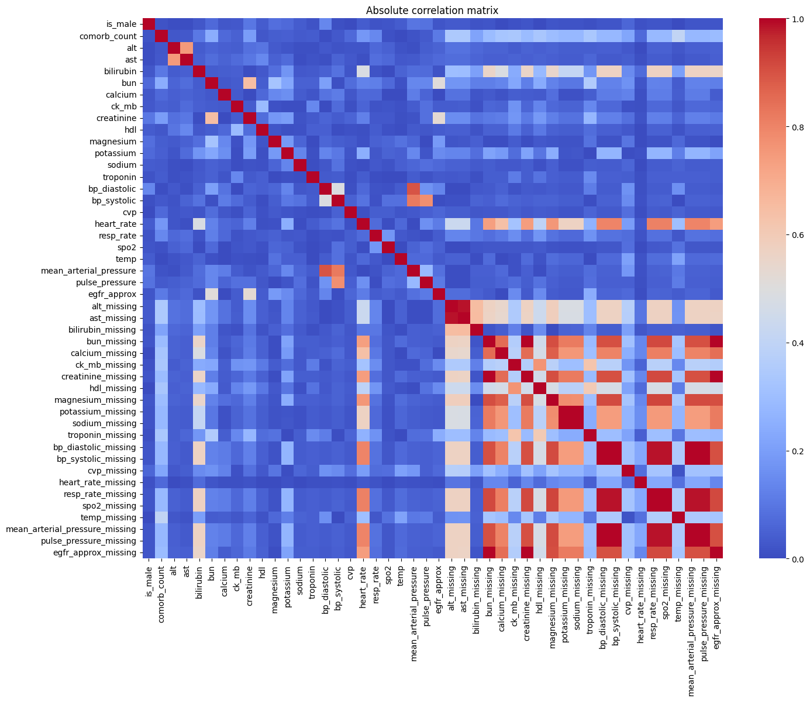
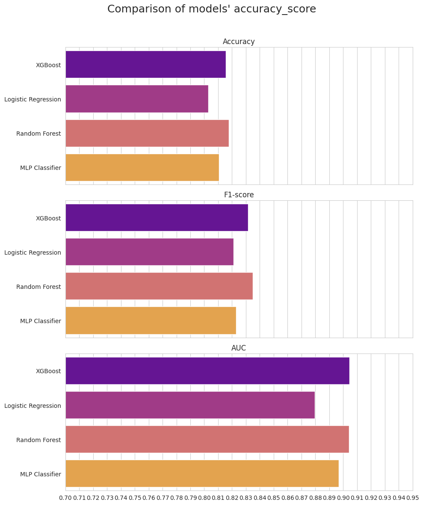
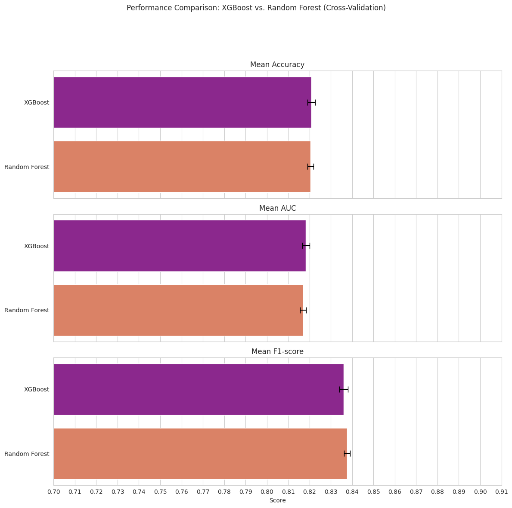
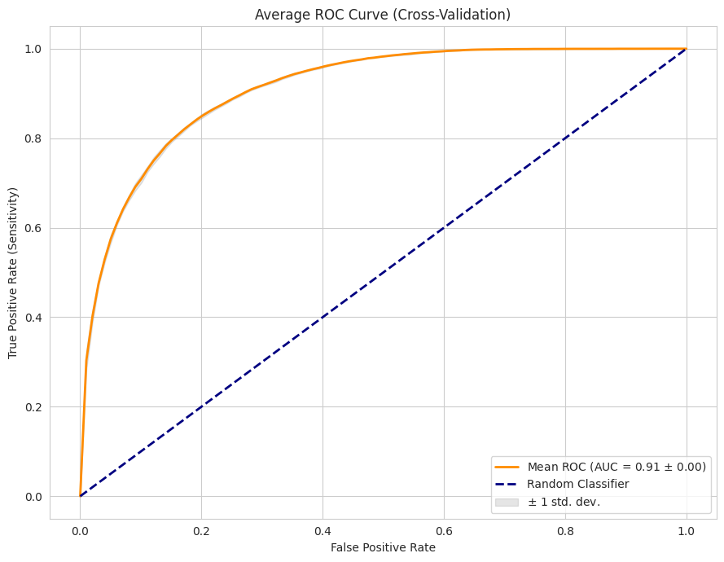
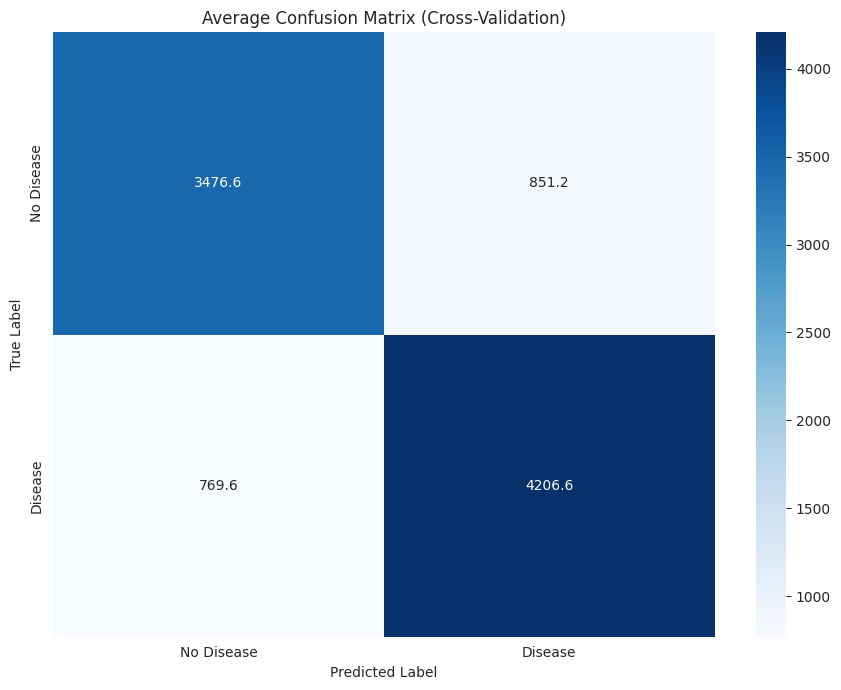
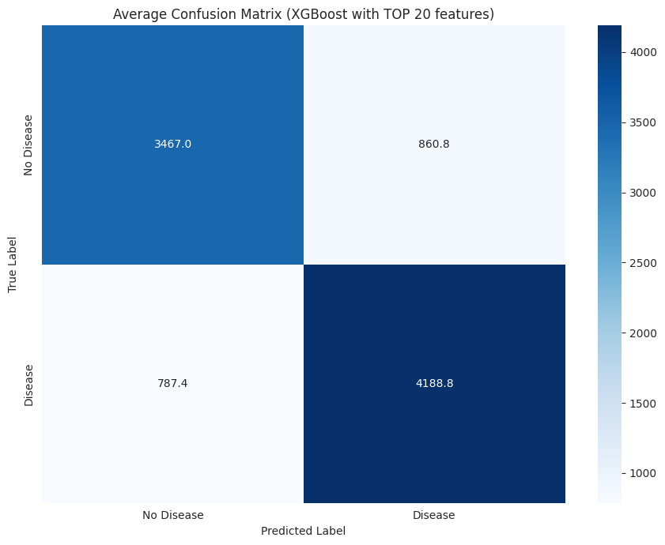

# HeartDiseaseMIMICPrediction

Project: Heart Disease Prediction using MIMIC-III Dataset
Link to collab for easy usage: https://colab.research.google.com/drive/1ZcyNRL6d72zmmFRqOhvgc7MDtZ3XTZFt?usp=sharing

## Project Goal
This project aims to predict the presence of heart disease using a comprehensive set of patient data from Kaggle (the MIMIC-III  database). The objective is to develop and evaluate machine learning models to accurately identify individuals at risk of heart disease, aiding in early diagnosis and intervention.

## Data Preprocessing Pipeline
The data preprocessing pipeline involved several critical steps to prepare the raw data for model training:

a. **Data Loading and Filtering**: The MIMIC-III tables (DIAGNOSES_ICD, PATIENTS, LABEVENTS, and CHARTEVENTS) were loaded efficiently in chunks to manage memory usage. Relevant `ITEMID`s were meticulously filtered to extract cardiac-related parameters, ensuring that only pertinent medical measurements were retained.

b. **Feature Engineering**: New features were engineered to enrich the dataset. This included creating binary comorbidity flags for respiratory conditions, diabetes, renal issues, liver problems, and other comorbidities, along with a `comorb_count`. Additionally, composite physiological features such as `mean_arterial_pressure`, `pulse_pressure`, and `egfr_approx` were derived from existing measurements.

c. **Missing Value Handling**: Missing values were addressed through a multi-step approach:
    - Columns with 70% or more missing values (e.g., 'cholesterol', 'crp', 'esr', 'ldl', 'nt_probnp', 'triglycerides', 'chol_hdl_ratio') were dropped to prevent noise and maintain data quality.
    - For the remaining columns with missing values, binary `_missing` flags were created to capture the missingness pattern as a feature itself.
    - The rest of the missing numerical values were imputed using the median strategy, chosen for its robustness to outliers.

d. **Correlation Analysis**: A correlation analysis was performed to identify and mitigate multicollinearity. Features highly correlated (absolute correlation coefficient > 0.8) with other features (e.g., `mean_arterial_pressure`, `pulse_pressure`, some `_missing` flags) were removed to improve model stability and interpretability.

e. **Outlier Capping**: Outliers in continuous numerical features were capped using the Interquartile Range (IQR) method (5.0 times the IQR) to prevent extreme values from disproportionately influencing model training.

## Initial Model Comparisons
Before extensive tuning, an initial comparison of several machine learning models was conducted on the full preprocessed dataset to establish baseline performance:
-   **XGBoost**
-   **Logistic Regression**
-   **Random Forest**
-   **MLP Classifier**

The models were evaluated based on Accuracy, F1-score, and AUC. This initial assessment helped in identifying promising candidates for further optimization, with XGBoost and Random Forest showing strong potential.

## XGB VS RandomForest
To be more detailed, 2 selected models have been compared in 5-fold cross-validation. As seen on the fiugure, XGB was outperfmornig RandomForest in parameters Accuracy and AUC, but not in F1 - score.

Nevertheless, it was decided to do the final training with XGB as it has more hiperparameter to tune, and it's faster and more versatile model.

## Hyperparameter Tuning
Optuna, an automatic hyperparameter optimization framework, was utilized for hyperparameter tuning. It was applied to both the Random Forest and XGBoost models to systematically search for the optimal set of parameters that maximize the Area Under the Receiver Operating Characteristic Curve (AUC) through cross-validation.

## XGB training
After tuning, XGB was trained and tested with the full set of preprocessed features. The results are the follwoing:
| Metric   | XGBoost (All Features) |
|----------|------------------------|
| Accuracy | 0.8273                 |
| F1-score | 0.8399                 | 
| AUC      | 0.9118                 |

## Feature Selection
To potentially improve model performance and reduce complexity, feature selection was performed using XGBoost's gain importance. The **top 20 most important features** were identified and used to create a reduced dataset.

## Comparison of XGBoost: All Features vs. Top 20 Features
The XGBoost model was evaluated using both the full set of preprocessed features and the selected top 20 features. 

The results are summarized below:

| Metric   | XGBoost (All Features) | XGBoost (Top 20 Features) |
|----------|------------------------|---------------------------|
| Accuracy | 0.8273                 | 0.8217                    |
| F1-score | 0.8399                 | 0.8347                    |
| AUC      | 0.9118                 | 0.9064                    |

The analysis indicated that the XGBoost model performed slightly better when trained with **all preprocessed features** compared to the reduced set of top 20 features across all metrics. Although the performance difference is marginal, the full feature set provided a minor but consistent predictive advantage. Given that the increase in model complexity for this dataset size was acceptable, using all features was deemed beneficial.

## Bonus: Model Comparison: Optimized XGBoost vs. Optimized Random Forest
To confirm XGB was indeed correct choice - After hyperparameter tuning of both models, a final comparison was made between the optimized XGBoost and Random Forest models on the full feature set. The results are summarized below:

| Metric   | XGBoost | Random Forest |
|----------|---------|---------------|
| Accuracy | 0.8273  | 0.8214        |
| F1-score | 0.8399  | 0.8397        |
| AUC      | 0.9118  | 0.9078        |

The **XGBoost model consistently demonstrated marginally better performance** across all three metrics (Accuracy, F1-score, and AUC) compared to the Random Forest model. Additionally, XGBoost generally exhibited faster execution during training and prediction. While Random Forest also performed commendably and is available for further review, XGBoost's slight outperformance and efficiency make it rightly preferred choice for this prediction task.

## Key Visualizations
Throughout the analysis, several key visualizations were used to understand the data, model performance, and feature contributions:
-   **Correlation Matrix**: To understand relationships between features and guide feature reduction.
-   **Confusion Matrices**: Visual representations of model predictions versus actual outcomes, providing insight into true positives, true negatives, false positives, and false negatives for different folds during cross-validation.
-   **ROC Curves**: Plots illustrating the diagnostic ability of a binary classifier system, particularly useful for understanding the trade-off between sensitivity and specificity, with confidence bands to show variability across cross-validation folds.
-   **Feature Importance Plots**: Bar plots showcasing the relative importance of each feature in the models (e.g., by gain for XGBoost), aiding in interpretability and understanding which variables contribute most to the predictions.
